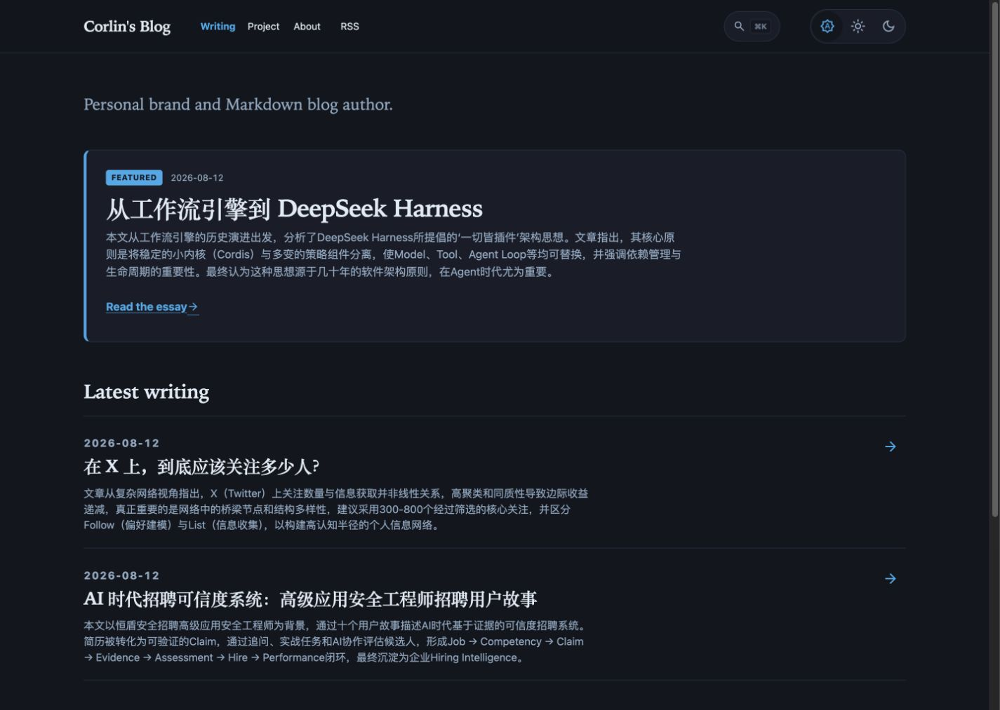
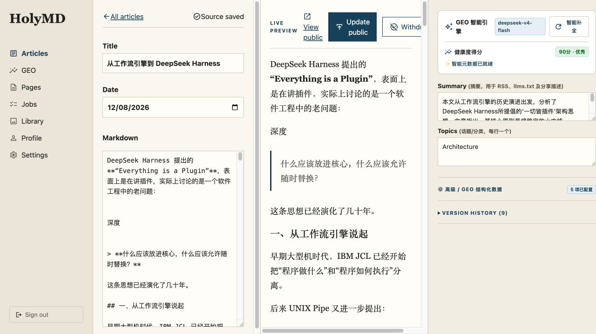
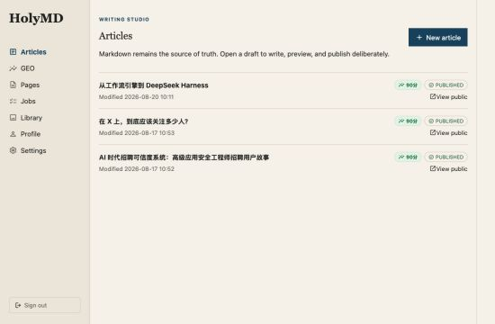

# HolyMD

English | [简体中文](README.zh-CN.md)

[](https://github.com/corlin/HolyMD/actions/workflows/ci.yml) [](LICENSE)

**HolyMD is a GEO-native, open-source engine for independent websites.** Write Markdown in a focused admin studio; publish an atomic static site that is optimized to be found, read, and cited by AI search engines and large language models — and runs on inexpensive shared PHP hosting.

GEO (Generative Engine Optimization) is built in rather than bolted on: every publish generates `llms.txt`, `llms-full.txt`, Schema.org graphs, feeds, and a sitemap; an optional AI reviewer proposes summaries, entities, FAQs, and alt text for you to accept or reject; and a dashboard shows which AI crawlers are reading which pages.

Article content lives in Markdown files on disk. MySQL holds only operational state: accounts, the job queue, build snapshots, audit logs, and GEO suggestions.

---

## Screenshots

### Public site

| Home | Article |
| --- | --- |
|  |  |

<p align="center">
  
  
</p>

### Admin and writing studio



| Articles | GEO health and AI crawler dashboard |
| --- | --- |
|  |  |

---

## Features

### GEO: be visible to AI search

- **AI discovery files** — `llms.txt` and a full-text `llms-full.txt` knowledge file are generated on every publish.
- **Schema.org graph** — `WebSite` and `Person` on the home page; `BlogPosting` with `author`, `publisher`, `inLanguage`, and `FAQPage` on articles; `WebPage` / `AboutPage` on standalone pages. Structured data is validated locally before it can be saved.
- **GEO Scorecard (0–100)** — weighted checks for summary (20), structured data (20), FAQ (15), entities (10), topics (10), sources (10), internal links (10), and image alt text (5, waived when there are no images). Links written naturally in the Markdown body count as sources and internal links automatically.
- **Human-in-the-loop AI reviewer** — optional and lazy: the model runs only when you click *Analyze*, never on autosave. It proposes metadata; it never rewrites your article body. Works with any OpenAI-compatible chat endpoint (DeepSeek, Claude, Gemini, and others).
- **AI crawler observability** — recognizes GPTBot, ClaudeBot, PerplexityBot, Google-AI, Bytespider, and more in the front controller, stores anonymized hashed visits, and shows 7-day crawl volume, bot share, most-crawled pages, and a live feed.
- **AI referral tracking** — counts human visitors arriving from ChatGPT, Perplexity, Gemini, Copilot, Claude, DeepSeek, Kimi, Doubao, Qwen, and other AI assistants (by referrer or `utm_source`), flags AI citations that land on dead URLs, and stores no IP address or user agent. Many AI apps send no referrer, so counts are a lower bound.
- **Does GEO pay off?** — lines up each article's GEO score with its AI crawls and AI referrals over 30 days, and compares articles scoring 80+ with the rest.
- **AI citation probes** — asks an AI search engine (Perplexity Sonar by default, any search-backed OpenAI-compatible API works) the FAQ questions of your articles and records whether the answer cites your site or the article itself. Runs weekly from cron or on demand from the dashboard; least recently probed questions go first, and each run is capped to control cost.
- **Topic and entity clusters** — see how deep your coverage is per topic and which named entities your site is building authority around.
- **Score history** — every successful publish records an immutable GEO score snapshot for trend tracking.

### Writing and publishing

- **Writing studio** — CommonMark live preview with proportional scroll sync and cursor-aware preview centering, silent autosave with checksum-based conflict protection.
- **Publish preflight** — before going live, the server re-runs metadata validation, a static build, and GEO checks against the exact candidate content. Blocking errors must be fixed; warnings must be acknowledged, and the acknowledgement is bound to the content checksum.
- **Immutable releases and one-click rollback** — articles and pages get a versioned snapshot on every publish; the public tree switches atomically via a pointer file.
- **Safe lifecycle** — published content must be withdrawn before it can be deleted; deletion cascades to its version history.
- **Standalone pages** — About, terms, and other pages with navigation ordering and version history.
- **Slug redirects** — renamed slugs keep working through generated 301 redirects.
- **Bilingual admin** — English and Simplified Chinese interface, switchable from the sidebar.
- **Localized public site** — reader-facing text (navigation, labels, meta descriptions, search, image viewer) follows `HOLYMD_SITE_LANGUAGE`; Chinese sites render in Chinese whatever language the admin uses.

### Reader experience

- Warm-paper design system with System / Light / Dark display modes and no flash on load.
- Instant site-wide search (`⌘K` / `Ctrl+K` / `/`).
- Keyboard-driven image viewer.
- RSS, Atom, JSON Feed, sitemap, and OpenGraph out of the box.

---

## Requirements

- **PHP** 8.4 or newer (8.5 supported) with `pdo_mysql`, `mbstring`, `fileinfo`, `gd`, `exif`, `sodium`, `openssl`, `json`, `curl`
- **MySQL** 8.0 or compatible (MariaDB 10.5+)
- **Web server** — Apache 2.4 with `mod_rewrite` and `.htaccess`, or Nginx
- **Composer** 2
- The PHP user needs write access to `content/`, `content/media/`, and `public/`

---

## Try it with Docker

The fastest way to see HolyMD is the bundled demo stack. It needs only Docker:

```bash
git clone https://github.com/corlin/HolyMD.git
cd HolyMD
docker compose up --build
```

When the log prints `HolyMD is ready`, open:

- Public site: `http://localhost:8080/` — three example articles with different GEO scores, plus `/llms.txt` and `/llms-full.txt`
- Admin: `http://localhost:8080/admin/login` — sign in as `admin@example.com` / `holymd-demo-password`

Set `HOLYMD_DEMO_PORT` to use another port. `docker compose down -v` removes the demo data. The demo uses PHP's built-in server and fixed credentials, so do not expose it to the internet.

## Quick start

```bash
# 1. Configure (database credentials and your site identity)
cp .env.example .env

# 2. Install dependencies
composer install

# 3. Create or upgrade the database schema
php bin/holymd-migrate.php

# 4. Create the first admin account
HOLYMD_ADMIN_PASSWORD='a-unique-password-at-least-12-characters' \
  php bin/holymd-admin.php create --email admin@example.com --display-name 'Site administrator'

# 5. Prepare the release pointer and verify a build
php bin/holymd-prepare-release.php
php bin/holymd-build.php --dry-run

# 6. Start the development server
php -S 127.0.0.1:8789 -t public bin/holymd-dev-router.php
```

- Public site: `http://127.0.0.1:8789/`
- Admin: `http://127.0.0.1:8789/admin/login`

Publishing and GEO reviews run through a job queue. Process it once with `php bin/holymd-worker.php`, or run it from cron. Hosts that cannot run cron or CLI workers can set `HOLYMD_SYNC_PUBLISH=1` to process jobs inside the request.

To enable the AI reviewer, encrypt your provider key into `.env` (the plaintext key only lives in your shell session):

```bash
HOLYMD_GEO_PLAINTEXT_KEY='sk-your-provider-key' php bin/holymd-admin.php encrypt-geo-key
```

Citation probes use their own key and a separate provider, since they need web search:

```bash
HOLYMD_PROBE_PLAINTEXT_KEY='pplx-your-key' php bin/holymd-admin.php encrypt-probe-key
php bin/holymd-probe.php --list      # preview which questions run next, no API calls
php bin/holymd-probe.php --limit 5   # ask five questions and record the results
```

Before the first production deploy, run all environment checks:

```bash
php bin/holymd-check.php
```

### Common environment variables

| Variable | Purpose | Default |
| --- | --- | --- |
| `HOLYMD_TIMEZONE` | Time zone for admin display; the database and machine output stay in UTC | `Asia/Singapore` |
| `HOLYMD_BASE_PATH` | Subdirectory install path, e.g. `/holymd` | empty |
| `HOLYMD_SYNC_PUBLISH` | Set to `1` on hosts without cron to publish and review in-request | `0` |
| `HOLYMD_PUBLIC_TREE` | Custom release pointer path | `public/.holymd-current` |
| `HOLYMD_LLMS_TXT` | Generate `llms.txt` and `llms-full.txt` | `1` |
| `HOLYMD_ADMIN_LOCALE` | Admin interface language, `en` or `zh-CN`; the sidebar switcher overrides it per browser | `zh-CN` for Chinese sites, otherwise `en` |

See [`.env.example`](.env.example) for the full list.

---

## Development

```bash
composer validate --strict
composer analyse        # PHPStan
composer test           # PHPUnit
php bin/holymd-build.php --dry-run
```

Responsive regression tests need Node.js 22+ and Chrome/Chromium. Locally they are skipped with a `REDUCED COVERAGE` marker when prerequisites are missing; in CI (or with `HOLYMD_BROWSER_REQUIRED=1`) they fail instead. `HOLYMD_CHROME_BIN` and `HOLYMD_NODE_BIN` override binary discovery.

Simulate AI crawler visits against the dev server to exercise the dashboard:

```bash
curl -s -o /dev/null -H "User-Agent: Mozilla/5.0 (compatible; GPTBot/1.2; +https://openai.com/gptbot)" http://127.0.0.1:8789/llms.txt
curl -s -o /dev/null -H "User-Agent: ClaudeBot/1.0; +claudebot@anthropic.com" http://127.0.0.1:8789/llms-full.txt

# AI referrals: a human visit from ChatGPT, by referrer or by utm_source
curl -s -o /dev/null -e 'https://chatgpt.com/' http://127.0.0.1:8789/
curl -s -o /dev/null 'http://127.0.0.1:8789/?utm_source=perplexity'
```

### Project layout

```text
HolyMD/
├── bin/          CLI tools: build, migrate, check, worker, admin, backup
├── content/      Markdown source of truth: articles/, pages/, media/, versions/
├── database/     schema.sql and incremental migrations
├── public/       Web root, admin assets, and atomic release pointer
├── src/          Application code (PSR-4 HolyMD\)
└── templates/    Public and admin PHP views
```

---

## Documentation

- [Shared hosting deployment](docs/operations/shared-hosting.md)
- [Backup and restore](docs/operations/backup-and-restore.md)
- [Product design specification](docs/superpowers/specs/2026-08-12-holymd-design.md) (Chinese)

---

## Contributing

Issues and pull requests are welcome — see [CONTRIBUTING.md](CONTRIBUTING.md).

## License

HolyMD is released under the [MIT License](LICENSE).
